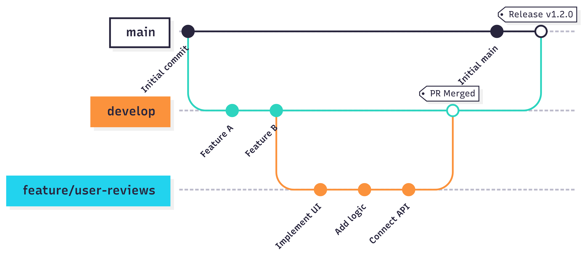

## 1. Cấu Trúc Thư Mục (Project Structure)

Dưới đây là ví dụ nha, ae tham khảo rồi triển khai thử:

```plaintext
TittleFoodApp/
├── app/ # Các trang (Màn hình) của ứng dụng theo Expo Router
│ ├── _layout.tsx # Layout chung cho toàn bộ ứng dụng (ví dụ: provider, font loader)
│ ├── IndexScreen.tsx # Màn hình khởi chạy đầu tiên (Welcome hoặc chuyển hướng)
│ ├── (onboarding)/
│ │ ├── IndexScreen.tsx
│ │ └── _layout.tsx
│ ├── (auth)/
│ │ ├── _layout.tsx
│ │ ├── LoginScreen.tsx
│ │ ├── SignupScreen.tsx
│ │ ├── SetPasswordScreen.tsx
│ │ └── SetFingerprintScreen.tsx
│ ├── (tabs)/
│ │ ├── _layout.tsx
│ │ ├── HomeScreen.tsx
│ │ ├── MenuScreen.tsx
│ │ ├── BestSellerScreen.tsx
│ │ ├── MyOrdersScreen.tsx
│ │ └── ProfileScreen.tsx
│ ├── (main)/
│ │ ├── _layout.tsx
│ │ ├── search/
│ │ │ └── IndexScreen.tsx
│ │ ├── food/
│ │ │ ├── [category].tsx
│ │ │ └── [id].tsx
│ │ ├── cart/
│ │ │ ├── IndexScreen.tsx
│ │ │ └── CheckoutScreen.tsx
│ │ ├── payment/
│ │ │ ├── IndexScreen.tsx
│ │ │ └── ConfirmedScreen.tsx
│ │ ├── order-details/
│ │ │ ├── [id].tsx
│ │ │ └── LiveTrackingScreen.tsx
│ │ ├── NotificationsScreen.tsx
│ │ └── profile/
│ │   ├── DeliveryAddressScreen.tsx
│ │   ├── PaymentMethodsScreen.tsx
│ │   ├── ContactUsScreen.tsx
│ │   ├── HelpScreen.tsx
│ │   └── SettingsScreen.tsx
│
├── modules/
│ ├── auth/
│ ├── user/
│ ├── product/
│ ├── order/
│ ├── cart/
│ └── common/
│
├── components/
│ ├── Button.tsx
│ ├── Input.tsx
│ ├── Modal.tsx
│ ├── Loader.tsx
│ ├── ScreenWrapper.tsx
│ └── Header.tsx
│
├── hooks/
│ ├── useTheme.ts
│ ├── usePermissions.ts
│ └── useNotifications.ts
│
├── store/
│ ├── useThemeStore.ts
│ └── useAppStatusStore.ts
│
├── services/
│ ├── apiClient.ts
│ └── notificationService.ts
│
├── utils/
│ ├── formatDate.ts
│ ├── formatCurrency.ts
│ └── navigationHelpers.ts
│
├── localization/
│ ├── en.json
│ ├── vi.json
│ └── index.ts
│
├── assets/
│ ├── images/
│ ├── fonts/
│ └── icons/
│
├── env/
├── tests/
├── .husky/
├── tailwind.config.js
├── app.config.ts
├── tsconfig.json
├── package.json
└── README.md
```

---

## 2. Nguyên Tắc Phát Triển (Development Principles)

### 2.1. Đặt Tên File và Thư Mục (Naming Conventions)

-   **Thư mục (Folders)**: Sử dụng `kebab-case`.
    -   Ví dụ: `order-details`, `payment-methods`.
-   **Màn hình (Screens)**: Các file `.tsx` trong thư mục `app/` sử dụng `PascalCaseScreen.tsx`.
    -   Ví dụ: `LoginScreen.tsx`, `HomeScreen.tsx`, `DeliveryAddressScreen.tsx`.
    -   **Ngoại lệ**: Các file đặc biệt của Expo Router như `_layout.tsx` và các file dynamic route như `[id].tsx`, `[...slug].tsx` giữ nguyên tên quy ước của framework.
-   **Components**: Sử dụng `PascalCase.tsx`.
    -   Ví dụ: `Button.tsx`, `FoodCard.tsx`, `OrderListItem.tsx`.
-   **Hooks**: Bắt đầu bằng `use` và sử dụng `camelCase.ts`.
    -   Ví dụ: `useAuth.ts`, `useProducts.ts`.
-   **Services**: Sử dụng `camelCase.ts` và có hậu tố `Service`.
    -   Ví dụ: `authService.ts`, `productService.ts`.
-   **Stores (Zustand)**: Bắt đầu bằng `use`, sử dụng `PascalCase` và có hậu tố `Store`.
    -   Ví dụ: `useCartStore.ts`, `useUserStore.ts`.
-   **Utils**: Sử dụng `camelCase.ts`.
    -   Ví dụ: `formatDate.ts`, `validationUtils.ts`.

### 2.2. Quy Trình Thêm Chức Năng Mới (Adding a New Feature)



Khi triển khai một chức năng mới, hãy tuân theo các bước sau để đảm bảo sự nhất quán:

1.  **Tạo Branch Mới**: Luôn bắt đầu từ branch `develop`, tạo một branch mới theo quy ước đặt tên trong mục Git.
    -   Ví dụ: `git checkout -b feature/user-reviews`

2.  **Xác định Vị Trí**:
    -   **Màn hình mới?**: Tạo file trong `app/` theo nhóm route phù hợp. Ví dụ, màn hình đánh giá sản phẩm có thể đặt tại `app/(main)/food/ReviewScreen.tsx`.
    -   **Logic phức tạp?**: Nếu chức năng yêu cầu nhiều components, hooks, và services riêng, hãy tạo một module mới trong `modules/`. Ví dụ: `modules/review/`.
        -   **Components của module**: Đặt trong `modules/review/components/`.
        -   **Hooks của module**: Đặt trong `modules/review/hooks/`.
        -   **Services của module**: Đặt trong `modules/review/services/`.
    -   **Component có thể tái sử dụng ở nơi khác?**: Nếu bạn tạo một component chung (ví dụ: `StarRating.tsx`), hãy đặt nó trong `components/`.
    -   **Hook có thể tái sử dụng ở nơi khác?**: Nếu hook có tính ứng dụng toàn cục (ví dụ: `useAnalytics.ts`), hãy đặt nó trong `hooks/`.

3.  **Triển Khai & Tích Hợp**: Viết code cho chức năng, kết nối UI với logic, và gọi API nếu cần.

4.  **Viết Test (Nếu có)**: Thêm unit test cho các hàm logic phức tạp trong `__tests__/unit/`.

5.  **Tạo Pull Request**: Sau khi hoàn thành và tự kiểm tra, tạo một Pull Request (PR) vào branch `develop`. Điền đầy đủ mô tả và yêu cầu review từ các thành viên khác.

### 2.3. Quy Ước Commit trên GitHub (Git Commit Convention)

**Cấu trúc một commit message:**

-   **`<type>`**: Loại commit (bắt buộc).
    -   `feat`: Thêm một tính năng mới (A new feature).
    -   `fix`: Sửa một lỗi (A bug fix).
    -   `docs`: Thay đổi chỉ liên quan đến tài liệu (documentation).
    -   `style`: Thay đổi không ảnh hưởng đến logic code (thụt lề, format, thiếu dấu chấm phẩy...).
    -   `refactor`: Viết lại code mà không sửa lỗi hay thêm tính năng mới.
    -   `perf`: Cải thiện hiệu năng.
    -   `test`: Thêm hoặc sửa test case.
    -   `chore`: Các thay đổi khác không liên quan đến source code hay test (cập nhật build scripts, quản lý dependencies...).

-   **`<scope>`**: Phạm vi của commit (không bắt buộc).
    -   Chỉ ra phần nào của dự án bị ảnh hưởng. Ví dụ: `auth`, `cart`, `profile`, `api`.

-   **`<subject>`**: Mô tả ngắn gọn, súc tích về thay đổi (bắt buộc).
    -   Viết ở thì hiện tại, không viết hoa chữ cái đầu, không có dấu chấm cuối câu.

**Ví dụ:**

-   `feat(auth): add sign in with google functionality`
-   `fix(cart): prevent crash when item quantity is zero`
-   `docs(readme): update setup instructions for new developers`
-   `refactor(user): change state management from Context to Zustand`
-   `chore: upgrade expo sdk to version 51`