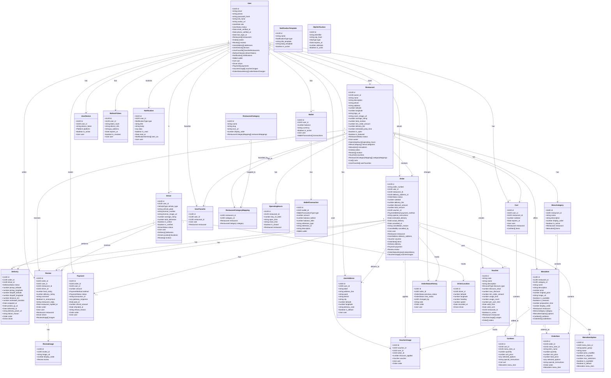
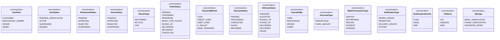

# Class Diagram

```mermaid
classDiagram
    class User {
        +UUID id
        +string email
        +string phone
        +string password_hash
        +string full_name
        +string avatar_url
        +UserRole role
        +UserStatus status
        +Date email_verified_at
        +Date phone_verified_at
        +Date last_login_at
        +Restaurant[] restaurants
        +Order[] orders
        +Review[] reviews
        +UserAddress[] addresses
        +UserDevice[] devices
        +UserFavorite[] favoriteRestaurants
        +RefreshToken[] refreshTokens
        +Notification[] notifications
        +Wallet wallet
        +Cart cart
        +Driver driver
        +Payment[] payments
        +VoucherUsage[] voucherUsages
        +OrderStatusHistory[] orderStatusChanges
    }

    class Restaurant {
        +UUID id
        +UUID owner_id
        +string name
        +string description
        +string phone
        +string address
        +number latitude
        +number longitude
        +string logo_url
        +string cover_image_url
        +number average_rating
        +number total_reviews
        +number min_order_amount
        +number delivery_fee
        +number estimated_prep_time
        +boolean is_open
        +boolean is_featured
        +RestaurantStatus status
        +User owner
        +OperatingHours[] operating_hours
        +MenuCategory[] menuCategories
        +MenuItem[] menuItems
        +Order[] orders
        +Review[] reviews
        +Voucher[] vouchers
        +RestaurantCategoryMapping[] categoryMappings
        +Cart[] carts
        +UserFavorite[] userFavorites
    }

    class Driver {
        +UUID id
        +UUID user_id
        +VehicleType vehicle_type
        +string vehicle_plate
        +string license_number
        +string license_image_url
        +number average_rating
        +number total_deliveries
        +boolean is_online
        +boolean is_verified
        +DriverStatus status
        +User user
        +Delivery[] deliveries
        +DriverLocation[] locations
        +Review[] reviews
    }

    class Wallet {
        +UUID id
        +UUID user_id
        +number balance
        +string currency
        +boolean is_active
        +User user
        +WalletTransaction[] transactions
    }

    class Cart {
        +UUID id
        +UUID user_id
        +UUID restaurant_id
        +number subtotal
        +Date expires_at
        +User user
        +Restaurant restaurant
        +CartItem[] items
    }

    class Order {
        +UUID id
        +string order_number
        +UUID user_id
        +UUID restaurant_id
        +UUID delivery_address_id
        +OrderStatus status
        +number subtotal
        +number delivery_fee
        +number discount_amount
        +number total_amount
        +UUID voucher_id
        +PaymentMethod payment_method
        +string special_instructions
        +Date estimated_delivery
        +Date actual_delivery
        +Date cancelled_at
        +string cancellation_reason
        +CancelledBy cancelled_by
        +User user
        +Restaurant restaurant
        +UserAddress delivery_address
        +Voucher voucher
        +OrderItem[] items
        +Delivery delivery
        +Payment payment
        +Review review
        +OrderStatusHistory[] statusHistory
        +VoucherUsage[] voucherUsages
    }

    class Delivery {
        +UUID id
        +UUID order_id
        +UUID driver_id
        +DeliveryStatus status
        +number pickup_latitude
        +number pickup_longitude
        +number dropoff_latitude
        +number dropoff_longitude
        +number distance_km
        +number estimated_duration
        +Date assigned_at
        +Date picked_up_at
        +Date delivered_at
        +string delivery_proof_url
        +string failure_reason
        +Order order
        +Driver driver
    }

    class Review {
        +UUID id
        +UUID order_id
        +UUID user_id
        +UUID restaurant_id
        +UUID driver_id
        +number food_rating
        +number delivery_rating
        +string comment
        +boolean is_anonymous
        +string restaurant_reply
        +Date restaurant_replied_at
        +Order order
        +User user
        +Restaurant restaurant
        +Driver driver
        +ReviewImage[] images
    }

    class Payment {
        +UUID id
        +UUID order_id
        +UUID user_id
        +number amount
        +PaymentMethod method
        +PaymentStatus status
        +string transaction_id
        +any gateway_response
        +Date paid_at
        +number refund_amount
        +Date refunded_at
        +string refund_reason
        +Order order
        +User user
    }

    class MenuCategory {
        +UUID id
        +UUID restaurant_id
        +string name
        +string description
        +number display_order
        +boolean is_active
        +Restaurant restaurant
        +MenuItem[] items
    }

    class MenuItem {
        +UUID id
        +UUID restaurant_id
        +UUID category_id
        +string name
        +string description
        +number price
        +number original_price
        +string image_url
        +boolean is_available
        +boolean is_featured
        +number preparation_time
        +number display_order
        +Restaurant restaurant
        +MenuCategory category
        +MenuItemOption[] options
        +CartItem[] cartItems
        +OrderItem[] orderItems
    }

    class MenuItemOption {
        +UUID id
        +UUID menu_item_id
        +string option_group
        +string name
        +number price_modifier
        +boolean is_required
        +number max_selections
        +boolean is_available
        +boolean is_default
        +MenuItem menu_item
    }

    class CartItem {
        +UUID id
        +UUID cart_id
        +UUID menu_item_id
        +number quantity
        +number unit_price
        +any selected_options
        +string special_instructions
        +Cart cart
        +MenuItem menu_item
    }

    class OrderItem {
        +UUID id
        +UUID order_id
        +UUID menu_item_id
        +string item_name
        +number quantity
        +number unit_price
        +number total_price
        +any selected_options
        +string special_instructions
        +Order order
        +MenuItem menu_item
    }

    class UserAddress {
        +UUID id
        +UUID user_id
        +string label
        +string address_line
        +string ward
        +string district
        +string city
        +number latitude
        +number longitude
        +string delivery_note
        +boolean is_default
        +User user
    }

    class UserDevice {
        +UUID id
        +UUID user_id
        +string device_token
        +Platform platform
        +boolean is_active
        +User user
    }

    class UserFavorite {
        +UUID id
        +UUID user_id
        +UUID restaurant_id
        +User user
        +Restaurant restaurant
    }

    class RefreshToken {
        +UUID id
        +UUID user_id
        +string token_hash
        +string device_info
        +string ip_address
        +Date expires_at
        +boolean is_revoked
        +User user
    }

    class Notification {
        +UUID id
        +UUID user_id
        +NotificationType type
        +string title
        +string body
        +any data
        +boolean is_read
        +Date read_at
        +NotificationSentVia[] sent_via
        +User user
    }

    class NotificationTemplate {
        +UUID id
        +string name
        +NotificationType type
        +string title_template
        +string body_template
        +boolean is_active
    }

    class OtpVerification {
        +UUID id
        +string identifier
        +string otp_hash
        +OtpType type
        +Date expires_at
        +number attempts
        +boolean is_used
    }

    class RestaurantCategory {
        +UUID id
        +string name
        +string slug
        +string icon_url
        +number display_order
        +RestaurantCategoryMapping[] restaurantMappings
    }

    class RestaurantCategoryMapping {
        +UUID restaurant_id
        +UUID category_id
        +Restaurant restaurant
        +RestaurantCategory category
    }

    class OperatingHours {
        +UUID id
        +UUID restaurant_id
        +number day_of_week
        +string open_time
        +string close_time
        +boolean is_closed
        +Restaurant restaurant
    }

    class Voucher {
        +UUID id
        +string code
        +string name
        +string description
        +DiscountType discount_type
        +number discount_value
        +number max_discount
        +number min_order_amount
        +number usage_limit
        +number usage_count
        +number per_user_limit
        +Date valid_from
        +Date valid_until
        +UUID restaurant_id
        +boolean is_active
        +Restaurant restaurant
        +VoucherUsage[] usages
        +Order[] orders
    }

    class VoucherUsage {
        +UUID id
        +UUID voucher_id
        +UUID user_id
        +UUID order_id
        +number discount_applied
        +Voucher voucher
        +User user
        +Order order
    }

    class WalletTransaction {
        +UUID id
        +UUID wallet_id
        +WalletTransactionType type
        +number amount
        +number balance_before
        +number balance_after
        +string reference_type
        +string reference_id
        +string description
        +Wallet wallet
    }

    class OrderStatusHistory {
        +UUID id
        +UUID order_id
        +OrderStatus previous_status
        +OrderStatus new_status
        +UUID changed_by
        +string note
        +Order order
        +User user
    }

    class ReviewImage {
        +UUID id
        +UUID review_id
        +string image_url
        +number display_order
        +Review review
    }

    class DriverLocation {
        +UUID id
        +UUID driver_id
        +number latitude
        +number longitude
        +number heading
        +number speed
        +Date recorded_at
        +Driver driver
    }

    %% User Relationships
    User "1" --> "*" Restaurant : owns
    User "1" --> "*" Order : places
    User "1" --> "*" Review : writes
    User "1" --> "*" UserAddress : has
    User "1" --> "*" UserDevice : has
    User "1" --> "*" UserFavorite : favorites
    User "1" --> "*" RefreshToken : has
    User "1" --> "*" Notification : receives
    User "1" --> "0..1" Wallet : has
    User "1" --> "0..1" Cart : has
    User "1" --> "0..1" Driver : is
    User "1" --> "*" Payment : makes
    User "1" --> "*" VoucherUsage : uses
    User "1" --> "*" OrderStatusHistory : changes

    %% Restaurant Relationships
    Restaurant "1" --> "*" MenuCategory : has
    Restaurant "1" --> "*" MenuItem : offers
    Restaurant "1" --> "*" Order : receives
    Restaurant "1" --> "*" Review : receives
    Restaurant "1" --> "*" Voucher : creates
    Restaurant "1" --> "*" RestaurantCategoryMapping : belongs_to
    Restaurant "1" --> "*" OperatingHours : has
    Restaurant "1" --> "*" Cart : has
    Restaurant "1" --> "*" UserFavorite : favorited_by

    %% Menu Relationships
    MenuCategory "1" --> "*" MenuItem : contains
    MenuItem "1" --> "*" MenuItemOption : has
    MenuItem "1" --> "*" CartItem : added_to
    MenuItem "1" --> "*" OrderItem : ordered_as

    %% Cart Relationships
    Cart "1" --> "*" CartItem : contains

    %% Order Relationships
    Order "1" --> "*" OrderItem : contains
    Order "1" --> "0..1" Delivery : has
    Order "1" --> "0..1" Payment : has
    Order "1" --> "0..1" Review : has
    Order "1" --> "*" OrderStatusHistory : tracks
    Order "1" --> "*" VoucherUsage : applies
    Order "*" --> "0..1" Voucher : uses
    Order "*" --> "1" UserAddress : delivers_to

    %% Driver Relationships
    Driver "1" --> "*" Delivery : performs
    Driver "1" --> "*" DriverLocation : tracks
    Driver "1" --> "*" Review : receives

    %% Review Relationships
    Review "1" --> "*" ReviewImage : has

    %% Wallet Relationships
    Wallet "1" --> "*" WalletTransaction : has

    %% Voucher Relationships
    Voucher "1" --> "*" VoucherUsage : tracks

    %% Restaurant Category Relationships
    RestaurantCategory "1" --> "*" RestaurantCategoryMapping : mapped_to
```

## Enum Types

```mermaid
classDiagram
    class UserRole {
        <<enumeration>>
        CUSTOMER
        RESTAURANT_OWNER
        DRIVER
        ADMIN
    }

    class UserStatus {
        <<enumeration>>
        PENDING_VERIFICATION
        ACTIVE
        SUSPENDED
        BANNED
    }

    class RestaurantStatus {
        <<enumeration>>
        PENDING
        APPROVED
        REJECTED
        SUSPENDED
    }

    class DriverStatus {
        <<enumeration>>
        PENDING
        APPROVED
        REJECTED
        SUSPENDED
    }

    class VehicleType {
        <<enumeration>>
        MOTORBIKE
        BICYCLE
        CAR
    }

    class OrderStatus {
        <<enumeration>>
        PENDING
        CONFIRMED
        PREPARING
        READY_FOR_PICKUP
        PICKED_UP
        DELIVERING
        DELIVERED
        CANCELLED
    }

    class PaymentMethod {
        <<enumeration>>
        CASH
        CREDIT_CARD
        DEBIT_CARD
        E_WALLET
        BANK_TRANSFER
    }

    class PaymentStatus {
        <<enumeration>>
        PENDING
        PROCESSING
        COMPLETED
        FAILED
        REFUNDED
    }

    class DeliveryStatus {
        <<enumeration>>
        ASSIGNED
        ACCEPTED
        PICKING_UP
        PICKED_UP
        DELIVERING
        DELIVERED
        FAILED
    }

    class CancelledBy {
        <<enumeration>>
        USER
        RESTAURANT
        DRIVER
        ADMIN
    }

    class DiscountType {
        <<enumeration>>
        PERCENTAGE
        FIXED_AMOUNT
    }

    class WalletTransactionType {
        <<enumeration>>
        DEPOSIT
        WITHDRAWAL
        REFUND
        PAYMENT
        EARNING
    }

    class NotificationType {
        <<enumeration>>
        ORDER_UPDATE
        PROMOTION
        DELIVERY_UPDATE
        SYSTEM
    }

    class NotificationSentVia {
        <<enumeration>>
        PUSH
        EMAIL
        SMS
    }

    class Platform {
        <<enumeration>>
        IOS
        ANDROID
        WEB
    }

    class OtpType {
        <<enumeration>>
        EMAIL_VERIFICATION
        PHONE_VERIFICATION
        PASSWORD_RESET
    }
```
